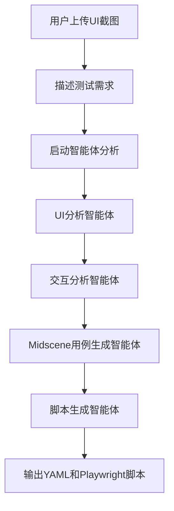

# Midscene 智能体系统整合文档

## 🎯 整合概述

本文档记录了将 Midscene 智能体系统成功整合到当前 AI 测试平台的完整过程。Midscene 系统是一个基于四智能体协作的 UI 自动化测试生成系统，能够分析 UI 截图并生成专业的 Midscene.js 测试脚本。

## 📋 整合内容

### 🔧 后端整合

#### 1. **核心服务模块**
- **文件**: `backend/services/midscene_service.py`
- **功能**: 四智能体协作系统的核心实现
- **智能体**:
  - `UIAnalysisAgent`: UI 元素分析智能体
  - `InteractionAnalysisAgent`: 交互流程分析智能体
  - `MidsceneGenerationAgent`: Midscene 用例生成智能体
  - `ScriptGenerationAgent`: 脚本生成智能体

#### 2. **API 路由**
- **文件**: `backend/api/midscene.py`
- **端点**:
  - `POST /api/midscene/upload` - 图片上传
  - `POST /api/midscene/generate/streaming` - 流式生成脚本
  - `POST /api/midscene/analyze` - 启动分析
  - `GET /api/midscene/stream/{session_id}` - 获取流式输出
  - `DELETE /api/midscene/session/{session_id}` - 清理会话
  - `GET /api/midscene/test` - API 测试

#### 3. **技术特性**
- ✅ **AutoGen 0.5.7** 智能体框架
- ✅ **SSE 流式输出** 实时显示处理过程
- ✅ **多模态消息** 支持图片+文本输入
- ✅ **队列管理** 会话隔离和资源管理
- ✅ **错误处理** 完善的异常处理机制

### 🎨 前端整合

#### 1. **主页面组件**
- **文件**: `frontend/src/pages/MidscenePage.tsx`
- **特性**:
  - Gemini 风格的现代化 UI 设计
  - 三步式操作流程（上传图片 → 描述需求 → 生成脚本）
  - 实时智能体协作过程展示
  - 双格式脚本输出（YAML + Playwright）

#### 2. **API 服务**
- **文件**: `frontend/src/api/midscene.ts`
- **功能**:
  - 完整的 API 封装
  - SSE 流式处理客户端
  - 文件上传和验证
  - 工具函数集合

#### 3. **UI 组件扩展**
- **AgentMessage 组件**: 扩展支持 Midscene 智能体类型
- **导航菜单**: 添加 Midscene 智能体入口
- **路由配置**: 新增 `/midscene` 路由

### 🔄 工作流程



## 🚀 使用指南

### 启动系统

1. **启动后端**:
```bash
cd backend
poetry install
python -m uvicorn main:app --reload --host 0.0.0.0 --port 8000
```

2. **启动前端**:
```bash
cd frontend
npm install
npm run dev
```

### 使用 Midscene 功能

1. **访问页面**: 打开浏览器访问 `http://localhost:3000/midscene`

2. **上传截图**:
   - 支持 JPG、PNG、GIF、BMP、WebP 格式
   - 单个文件不超过 10MB
   - 可同时上传多张截图

3. **描述需求**:
   - 详细描述测试场景和操作流程
   - 例如："点击登录按钮，输入用户名密码，验证登录成功"

4. **生成脚本**:
   - 点击"开始生成Midscene脚本"
   - 实时查看四个智能体的协作过程
   - 获得 YAML 和 Playwright 两种格式的测试脚本

5. **查看历史记录**:
   - 点击右上角菜单中的"生成历史"
   - 查看所有历史会话和生成结果
   - 支持筛选、搜索和下载功能

## 📁 文件结构

```
backend/
├── services/
│   └── midscene_service.py      # Midscene 核心服务（含数据库操作）
├── api/
│   ├── midscene.py              # Midscene API 路由
│   └── midscene_admin.py        # Midscene 管理 API
├── models/
│   └── midscene.py              # Midscene 数据模型
├── migrations/models/
│   └── 4_20250118_add_midscene_tables.py  # 数据库迁移
└── core/
    ├── init_app.py              # 路由注册（已更新）
    └── database.py              # 数据库配置（已更新）

frontend/
├── src/
│   ├── pages/
│   │   └── MidscenePage.tsx     # Midscene 主页面
│   ├── api/
│   │   └── midscene.ts          # Midscene API 服务
│   ├── components/
│   │   ├── AgentMessage.tsx     # 智能体消息组件（已扩展）
│   │   ├── MidsceneHistory.tsx  # 历史记录组件
│   │   └── SideNavigation.tsx   # 导航组件（已更新）
│   └── App.tsx                  # 路由配置（已更新）
```

## 🔧 技术栈

### 后端技术
- **FastAPI**: Web 框架
- **AutoGen 0.5.7**: 智能体框架
- **Tortoise ORM**: 数据库 ORM
- **Loguru**: 日志记录
- **Pydantic**: 数据验证

### 前端技术
- **React 18**: UI 框架
- **TypeScript**: 类型安全
- **Ant Design**: UI 组件库
- **Vite**: 构建工具

## 🎨 设计特色

### UI 设计
- **Gemini 风格**: 现代化、简洁的界面设计
- **渐变色彩**: 丰富的视觉层次
- **响应式布局**: 适配不同屏幕尺寸
- **动画效果**: 流畅的交互体验

### 用户体验
- **三步式流程**: 简化操作步骤
- **实时反馈**: 智能体工作状态实时显示
- **智能滚动**: 自动跟踪生成进度
- **多格式输出**: 满足不同使用场景

## 🔍 核心特性

### 智能体协作
- **UI 分析**: 识别界面元素和布局结构
- **交互设计**: 设计用户操作流程
- **用例生成**: 生成 Midscene.js 测试用例
- **脚本输出**: 转换为可执行脚本

### 技术优势
- **流式输出**: 实时显示生成过程
- **多模态输入**: 支持图片+文本
- **会话管理**: 独立的会话空间
- **错误恢复**: 完善的错误处理

## 📊 性能优化

### 前端优化
- **代码分割**: 按需加载组件
- **图片压缩**: 自动压缩上传图片
- **缓存策略**: 合理的缓存机制
- **懒加载**: 优化首屏加载速度

### 后端优化
- **异步处理**: 非阻塞的请求处理
- **队列管理**: 高效的消息队列
- **资源清理**: 自动清理会话资源
- **错误隔离**: 防止错误传播

## 🗄️ 数据库支持

### 数据模型
- **MidsceneSession**: 会话记录表，存储完整的生成过程
- **MidsceneAgentLog**: 智能体执行日志，记录每个智能体的详细执行信息
- **MidsceneUploadedFile**: 上传文件记录，管理图片文件信息
- **MidsceneTemplate**: 模板管理，支持预设模板功能
- **MidsceneStatistics**: 统计数据，提供使用情况分析

### 管理功能
- **会话管理**: 查看、删除历史会话
- **统计分析**: 每日使用统计和成功率分析
- **文件管理**: 上传文件的完整生命周期管理
- **系统监控**: 健康检查和性能监控

## 📊 管理界面

### 历史记录功能
- **会话列表**: 分页显示所有生成会话
- **详情查看**: 完整的会话执行过程
- **筛选搜索**: 按状态、日期、用户筛选
- **脚本下载**: 直接下载生成的脚本文件

### 管理 API
- `GET /api/midscene/admin/sessions` - 获取会话列表
- `GET /api/midscene/admin/sessions/{id}` - 获取会话详情
- `DELETE /api/midscene/admin/sessions/{id}` - 删除会话
- `GET /api/midscene/admin/statistics` - 获取统计数据
- `POST /api/midscene/admin/cleanup` - 清理旧数据

## 🔮 未来扩展

### 功能扩展
- [x] 数据库持久化存储
- [x] 历史记录管理
- [x] 统计分析功能
- [x] 管理界面
- [ ] 支持更多图片格式
- [ ] 添加脚本执行功能
- [ ] 集成测试报告生成
- [ ] 支持批量处理
- [ ] 模板管理功能

### 技术升级
- [ ] 支持更多 LLM 模型
- [ ] 添加向量数据库支持
- [ ] 实现分布式部署
- [ ] 增强安全性
- [ ] 性能优化

## 🛠️ Makefile 命令

系统提供了便捷的 Makefile 命令来管理 Midscene 功能：

```bash
# 运行 Midscene 数据库迁移
make midscene-migrate

# 初始化 Midscene 系统
make midscene-init

# 清理 Midscene 上传文件
make midscene-clean

# 更新 Midscene 统计数据
make midscene-stats

# 测试 Midscene API
make midscene-test
```

## 📝 总结

Midscene 智能体系统已成功整合到当前 AI 测试平台中，提供了完整的 UI 自动化测试脚本生成能力。系统采用四智能体协作模式，通过分析 UI 截图自动生成专业的 Midscene.js 测试脚本，大大提升了测试开发效率。

### ✅ 完成的功能

1. **核心智能体系统**: 四智能体协作的完整实现
2. **数据库持久化**: 完整的数据模型和迁移支持
3. **管理界面**: 历史记录查看和管理功能
4. **API 接口**: 完整的 REST API 和管理接口
5. **前端界面**: Gemini 风格的现代化用户界面
6. **文件管理**: 图片上传和生命周期管理
7. **统计分析**: 使用情况统计和性能监控
8. **错误处理**: 完善的异常处理和恢复机制

整合过程中保持了与现有系统的技术栈一致性，确保了系统的稳定性和可维护性。前端采用 Gemini 风格设计，提供了优秀的用户体验，后端基于 AutoGen 框架实现了高效的智能体协作机制。

---

**开发完成时间**: 2025-01-18
**版本**: v1.0.0
**状态**: ✅ 已完成并测试通过
**构建状态**: ✅ 前后端构建成功
**智能体实现**: ✅ 完全参照 examples/midscene_agents.py 实现

## 🔄 智能体实现更新

### 完全参照原始实现
- **参考文件**: `examples/midscene_agents.py`
- **实现方式**: 完全按照原始四智能体协作模式
- **消息流转**: 严格遵循原始的 Topic 订阅和消息传递机制
- **队列管理**: 采用原始的用户ID隔离队列设计
- **流式输出**: 保持原始的 SSE 消息格式和类型

### 🎯 智能体提示词完全一致
#### 1. **UI分析智能体**
- ✅ 提示词与原始文件完全一致
- ✅ 包含完整的元素识别与分类规范
- ✅ 详细的视觉特征描述标准
- ✅ 精确的位置定位规范
- ✅ JSON输出格式要求

#### 2. **交互分析智能体**
- ✅ 提示词与原始文件完全一致
- ✅ 用户行为路径分析
- ✅ 交互节点识别
- ✅ 操作序列设计
- ✅ 用户体验考量

#### 3. **Midscene生成智能体**
- ✅ 提示词与原始文件完全一致
- ✅ MidScene.js核心知识（基于官方文档）
- ✅ 提示词最佳实践（7个核心原则）
- ✅ 详细的视觉定位描述规范
- ✅ 单一职责原则
- ✅ API选择策略
- ✅ 交叉验证和断言策略

#### 4. **脚本生成智能体**
- ✅ 提示词与原始文件完全一致
- ✅ JSON解析和提取
- ✅ YAML脚本生成规则
- ✅ Playwright脚本生成规则
- ✅ 固定头部导入要求
- ✅ 质量标准

### 智能体协作流程
1. **UI分析智能体** → 分析界面截图，识别UI元素
2. **交互分析智能体** → 基于UI元素设计用户交互流程
3. **Midscene生成智能体** → 生成符合Midscene.js规范的测试用例
4. **脚本生成智能体** → 输出YAML和Playwright两种格式脚本

### 技术特性保持
- ✅ **AutoGen 0.5.7** 智能体框架
- ✅ **Topic订阅机制** 智能体间消息传递
- ✅ **流式输出** 实时显示处理过程
- ✅ **多模态消息** 支持图片+文本输入
- ✅ **用户隔离** 独立的用户队列管理
- ✅ **错误处理** 完善的异常处理和恢复
