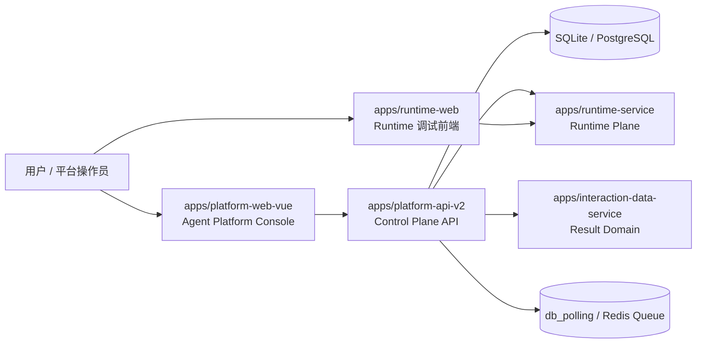

# Platform API V2 Project Handbook

这份文档是 `apps/platform-api-v2` 的总手册。

如果你是第一次接手这套控制面，或者你已经看过代码但还是没搞清楚“这服务到底怎么用、为什么要这么拆、权限到底怎么判”，先看这份文档，不要一头扎进 `phase-*` 里迷路。

## 1. 这套服务是干什么的

`platform-api-v2` 是平台治理层后端，也就是 control plane。

它负责：

- 身份认证与平台权限
- 项目、成员、用户、助手等控制面主数据
- 平台配置、服务账号、公告、审计、操作中心
- 受控访问 `runtime-service`
- 给 `apps/platform-web-vue` 提供稳定平台 API

它不负责：

- 智能体图执行本身
- MCP / tool 的真实装配与运行
- testcase 结果域真实存储
- 调试前端本身的交互逻辑

一句话说：

> `platform-api-v2` 管“治理和边界”，`runtime-service` 管“运行和执行”。

## 2. 整体架构图



## 3. 上层业务应该怎么使用这套平台

上层业务不要把 `platform-api-v2` 当成一个“万能后端”。

正确使用方式是按职责走：

| 业务诉求 | 应该走哪层 | 说明 |
| --- | --- | --- |
| 登录、当前用户资料、修改密码 | `identity` | 属于平台身份域 |
| 用户、项目、成员管理 | `users` / `projects` | 属于平台治理主数据 |
| 公告、审计、平台配置、服务账号 | `announcements` / `audit` / `platform_config` / `service_accounts` | 属于平台治理能力 |
| 助手、graph、thread、chat、运行入口 | `assistants` + `runtime_gateway` + `runtime_catalog` | 平台负责受控访问和上下文注入，不直接替代 runtime |
| testcase 管理、导出、预览 | `testcase` | 结果数据仍在 `interaction-data-service` |
| 长耗时刷新、导出、批处理 | `operations` | 通过 operation/job 跟踪状态，不在 HTTP 里硬等 |

### 3.1 前端如何用

`apps/platform-web-vue` 是正式平台前端宿主。

它应该：

- 只调用 `platform-api-v2`
- 不直接跨过控制面去乱打 `runtime-service`
- 通过项目上下文和用户身份访问平台资源
- 遇到长任务统一走 `operations`

### 3.2 业务方如果要接入新的平台能力

推荐顺序：

1. 先确认能力属于平台治理还是运行时执行
2. 如果属于平台治理，在 `platform-api-v2` 新增模块或 use case
3. 如果需要调用智能体、graph、thread，优先经由 `runtime_gateway`
4. 如果结果是业务域数据，不要塞进控制面库，放进专门结果域服务
5. 如果动作超过 3 秒，优先建 operation

## 4. 为什么要这样拆

如果不拆，平台侧最后一定会烂成一锅：

- 登录和项目权限混在一起
- 页面直接打 runtime，边界失控
- 长任务塞在 HTTP 里，超时和重试全靠运气
- 审计只有 access log，出了事查不到人
- 后续接 Redis、PostgreSQL、对象存储时只能推翻重写

现在这套拆法的目标很直接：

- 前端有稳定宿主
- 控制面有稳定边界
- runtime 继续专注执行
- 结果域继续专注业务结果
- 后面接队列、中间件、对象存储时不需要重做目录结构

## 5. 代码结构分别负责什么

```text
apps/platform-api-v2/
├── app/
│   ├── adapters/
│   ├── bootstrap/
│   ├── core/
│   ├── entrypoints/
│   └── modules/
├── tests/
├── docs/
├── deploy/
└── scripts/
```

### 5.1 `app/core`

放全局共享能力：

- settings
- request / actor context
- db session
- shared error
- normalization
- observability
- security primitives

### 5.2 `app/modules`

放业务模块，每个模块都按下面四层收：

```text
module/
  domain/
  application/
  infra/
  presentation/
```

每层职责：

- `domain`：领域模型、枚举、纯业务语义
- `application`：use case、command/query、policy、service
- `infra`：repository、SQLAlchemy、外部依赖落地
- `presentation`：HTTP DTO 与 router

### 5.3 `app/adapters`

放外部系统接入：

- `langgraph`
- `interaction_data`
- 后续可扩展 `redis`、`object_storage`、`notification`

### 5.4 `app/entrypoints`

放协议入口：

- `http/`
- `worker/`

这里只做接入，不做复杂业务编排。

### 5.5 `tests`

用于放权限、审计、模块行为、operation、adapter 回归测试。

### 5.6 `docs`

放长期有效的手册、标准、交付文档和阶段归档。

## 6. 目前主要模块怎么理解

| 模块 | 作用 | 不该干什么 |
| --- | --- | --- |
| `identity` | 登录、刷新、当前用户 | 不直接承接项目权限 |
| `iam` | 平台级 / 项目级权限模型 | 不让 handler 自己硬编码角色 |
| `projects` | 项目与成员治理 | 不替代全局用户管理 |
| `assistants` | assistant 平台主数据和映射 | 不直接执行 runtime run |
| `runtime_catalog` | graph/model/tool 的受控目录视图 | 不篡改 runtime 真相源 |
| `runtime_gateway` | 受控代理 runtime upstream | 不承接平台主数据 |
| `testcase` | testcase 控制面接口、导出聚合 | 不持有结果域真实数据 |
| `announcements` | 公告管理与可见性 | 不碰权限主逻辑 |
| `audit` | 审计查询与事件模型 | 不只记 access log |
| `operations` | 长任务、重试、取消、artifact | 不在 HTTP 中直接把任务跑完 |
| `platform_config` | 平台级配置治理 | 不让页面绕开配置直接写死行为 |
| `service_accounts` | 服务账号与 token 管理 | 不混入普通用户登录链路 |

## 7. 权限规则到底是什么

这块是最容易被写烂的，所以单独说透。

### 7.1 权限分两层

平台级角色：

- `platform_super_admin`
- `platform_operator`
- `platform_viewer`

项目级角色：

- `project_admin`
- `project_editor`
- `project_executor`

### 7.2 最核心的铁律

- 项目级角色永远不能自动变成平台级角色
- 平台级角色也不能绕过项目归属校验直接乱操作项目资源
- handler 不允许手写一堆 `if role == "admin"` 散装判断
- 所有权限判定统一基于 `ActorContext`

### 7.3 你可以这样理解

平台级权限管的是：

- 用户管理
- 平台配置
- 全局审计
- 服务账号
- 全局 operation 治理

项目级权限管的是：

- 项目资源读写
- 项目成员
- assistant project scope
- testcase project scope
- runtime gateway 的项目边界

### 7.4 典型例子

- 某人是 `project_admin`
  - 可以管理自己项目里的成员和资源
  - 不能管理全局用户
  - 不能改平台配置
- 某人是 `platform_operator`
  - 可以看平台治理页和全局运维能力
  - 如果要操作某个项目资源，仍然需要项目归属与对应权限
- 某人是 `platform_viewer`
  - 只能看，不应该拿到写权限

详细规则见：

- `../standards/permission-standard.md`

## 8. 审计规则是什么

审计不是 access log 美化版，它要回答：

- 谁做的
- 对哪个资源做的
- 成功还是失败
- 属于哪个 plane
- 花了多久

必须落的关键字段：

- `request_id`
- `plane`
- `action`
- `target_type`
- `target_id`
- `actor_user_id`
- `project_id`
- `result`
- `status_code`
- `duration_ms`

动作命名统一是：

`{domain}.{resource}.{verb}`

例如：

- `identity.session.created`
- `project.member.removed`
- `operation.failed`

详细规则见：

- `../standards/audit-standard.md`

## 9. Operation 是怎么用的

不是所有动作都该同步执行。

这些典型动作应该优先走 `operations`：

- refresh
- export
- batch sync
- 大文件导入
- 需要重试 / 取消 / 历史追踪的任务

典型调用方式：

1. 页面或业务入口提交一个动作
2. 后端返回 `operation_id`
3. 前端轮询或订阅 operation 状态
4. 完成后查看结果、错误或 artifact

这套模式的好处：

- 请求不会卡死
- 可重试、可取消、可审计
- 后续可平滑切到 Redis / 独立 worker

详细规则见：

- `../standards/operations-standard.md`

## 10. 新功能应该怎么开发

标准顺序不要乱：

1. 先确认这是平台治理能力还是 runtime 执行能力
2. 确认归属哪个模块
3. 先定义 request / response / command / query
4. 补权限边界
5. 补审计动作
6. 判断是否要进入 operation
7. 再写 `domain -> application -> infra -> presentation`
8. 补测试
9. 补文档和验收说明

### 10.1 不该怎么做

- 不要直接在 handler 里写业务
- 不要直接跨模块乱读 repository
- 不要为了快先跳过权限和审计
- 不要把结果域数据直接塞进控制面
- 不要让前端绕过控制面直打底层服务

## 11. 给新同事和协作者的推荐阅读顺序

1. `README.md`
2. `project-handbook.md`
3. `architecture.md`
4. `development-playbook.md`
5. `../standards/permission-standard.md`
6. `../standards/audit-standard.md`
7. `../standards/operations-standard.md`
8. `../delivery/change-delivery-checklist.md`
9. `../delivery/module-delivery-template.md`
10. `../archive/phases/`

## 12. 这份手册的定位

这份文档不是阶段纪要，也不是 release note。

它是 `platform-api-v2` 的稳定认知入口，用来回答三件事：

- 这套服务现在是什么
- 上层业务应该怎么用它
- 后续开发应该怎么在这套边界内继续往前推
