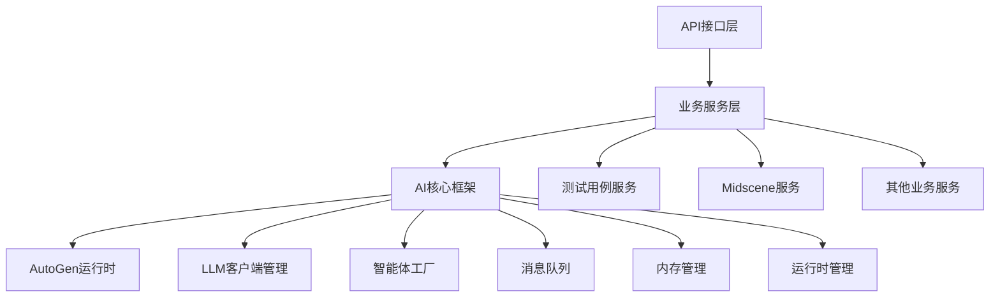

# 框架集成与最佳实践指南

[← 返回开发指南](./AI_CORE_DEVELOPMENT_GUIDE.md) | [📖 文档中心](../../../docs/) | [📋 导航索引](../../../docs/DOCS_INDEX.md)

## 🎯 概述

本文档详细介绍如何将AI核心框架与业务系统集成，包括通用组件与业务结合的最佳实践、性能优化策略、错误处理机制等。

## 🏗️ 框架集成架构

### 1. 分层架构设计

```
┌─────────────────────────────────────────┐
│              API接口层                    │  ← FastAPI路由，SSE接口
├─────────────────────────────────────────┤
│              业务服务层                   │  ← 业务逻辑封装，服务类
├─────────────────────────────────────────┤
│              AI核心框架层                 │  ← 通用组件，智能体管理
├─────────────────────────────────────────┤
│              AutoGen运行时层              │  ← AutoGen 0.5.7核心
└─────────────────────────────────────────┘
```

### 2. 组件依赖关系



## 🔧 通用组件与业务结合

### 1. 智能体工厂的业务应用

#### 业务特定的智能体创建

```python
from backend.ai_core import create_assistant_agent

class TestCaseAgentFactory:
    """测试用例智能体工厂"""

    @staticmethod
    async def create_requirement_analyst(conversation_id: str) -> AssistantAgent:
        """创建需求分析智能体"""
        return await create_assistant_agent(
            name="requirement_analyst",
            system_message=TestCasePrompts.REQUIREMENT_ANALYSIS,
            conversation_id=conversation_id,
            auto_memory=True,
            auto_context=True,
            model_type="deepseek"  # 指定模型类型
        )

    @staticmethod
    async def create_testcase_generator(conversation_id: str) -> AssistantAgent:
        """创建测试用例生成智能体"""
        return await create_assistant_agent(
            name="testcase_generator",
            system_message=TestCasePrompts.TESTCASE_GENERATION,
            conversation_id=conversation_id,
            auto_memory=True,
            auto_context=True,
            model_type="deepseek"
        )
```

#### 智能体配置管理

```python
class AgentConfig:
    """智能体配置管理"""

    REQUIREMENT_ANALYSIS = {
        "temperature": 0.7,
        "max_tokens": 2000,
        "timeout": 60.0
    }

    TESTCASE_GENERATION = {
        "temperature": 0.8,
        "max_tokens": 4000,
        "timeout": 120.0
    }

    @classmethod
    def get_config(cls, agent_type: str) -> Dict[str, Any]:
        """获取智能体配置"""
        return getattr(cls, agent_type.upper(), {})
```

### 2. 消息队列的业务集成

#### 业务消息类型定义

```python
from enum import Enum

class MessageType(Enum):
    """业务消息类型"""

    # 系统消息
    SYSTEM_INFO = "system_info"
    SYSTEM_ERROR = "system_error"

    # 智能体消息
    AGENT_THINKING = "agent_thinking"
    AGENT_RESULT = "agent_result"
    AGENT_QUESTION = "agent_question"

    # 用户交互
    USER_FEEDBACK_REQUEST = "user_feedback_request"
    USER_FEEDBACK_RESPONSE = "user_feedback_response"

    # 流程控制
    PROCESS_START = "process_start"
    PROCESS_COMPLETE = "process_complete"
    PROCESS_ERROR = "process_error"

class BusinessMessageQueue:
    """业务消息队列封装"""

    @staticmethod
    async def send_agent_message(conversation_id: str, content: str,
                                agent_name: str, message_type: MessageType):
        """发送智能体消息"""
        message = {
            "type": message_type.value,
            "content": content,
            "source": agent_name,
            "conversation_id": conversation_id,
            "timestamp": datetime.now().isoformat(),
        }

        await put_message_to_queue(
            conversation_id,
            json.dumps(message, ensure_ascii=False)
        )

    @staticmethod
    async def request_user_feedback(conversation_id: str, prompt: str,
                                   timeout: float = 300.0) -> str:
        """请求用户反馈"""
        # 发送反馈请求
        await BusinessMessageQueue.send_agent_message(
            conversation_id, prompt, "system", MessageType.USER_FEEDBACK_REQUEST
        )

        # 等待用户反馈
        feedback = await get_feedback_from_queue(conversation_id, timeout=timeout)
        return feedback or "继续"
```

### 3. 内存管理的业务应用

#### 业务数据结构化存储

```python
from backend.ai_core.memory import save_to_memory, get_conversation_history

class BusinessMemoryManager:
    """业务内存管理器"""

    @staticmethod
    async def save_requirement_analysis(conversation_id: str, analysis: str,
                                       metadata: Dict[str, Any] = None):
        """保存需求分析结果"""
        await save_to_memory(conversation_id, {
            "type": "requirement_analysis",
            "content": analysis,
            "stage": "analysis_complete",
            "metadata": metadata or {}
        })

    @staticmethod
    async def save_testcase_result(conversation_id: str, testcases: str,
                                  round_number: int = 1):
        """保存测试用例结果"""
        await save_to_memory(conversation_id, {
            "type": "testcase_result",
            "content": testcases,
            "round_number": round_number,
            "stage": "generation_complete",
            "metadata": {
                "testcase_count": len(testcases.split('\n')),
                "generation_time": datetime.now().isoformat()
            }
        })

    @staticmethod
    async def get_conversation_summary(conversation_id: str) -> Dict[str, Any]:
        """获取对话摘要"""
        history = await get_conversation_history(conversation_id)

        summary = {
            "total_messages": len(history),
            "stages": [],
            "last_activity": None
        }

        for item in history:
            if item.get("stage"):
                summary["stages"].append(item["stage"])
            if item.get("timestamp"):
                summary["last_activity"] = item["timestamp"]

        return summary
```

## 🚀 业务服务开发模式

### 1. 服务基类设计

```python
from abc import ABC, abstractmethod
from backend.ai_core import validate_model_configs

class BaseAIService(ABC):
    """AI服务基类"""

    def __init__(self):
        self.memory_manager = BusinessMemoryManager()
        self.message_queue = BusinessMessageQueue()

    async def validate_prerequisites(self) -> bool:
        """验证前置条件"""
        # 验证模型配置
        configs = validate_model_configs()
        if not any(configs.values()):
            logger.error("没有可用的模型配置")
            return False

        return True

    async def handle_error(self, conversation_id: str, error: Exception):
        """统一错误处理"""
        error_message = f"服务处理失败: {str(error)}"
        logger.error(f"❌ [服务错误] {error_message} | 对话ID: {conversation_id}")

        await self.message_queue.send_agent_message(
            conversation_id, error_message, "system", MessageType.SYSTEM_ERROR
        )

    @abstractmethod
    async def process_request(self, request: Any) -> Any:
        """处理业务请求（抽象方法）"""
        pass
```

### 2. 具体服务实现

```python
class TestCaseService(BaseAIService):
    """AI测试用例生成服务"""

    def __init__(self):
        super().__init__()
        self.runtime = get_testcase_runtime()

    async def process_request(self, requirement: RequirementMessage) -> None:
        """处理测试用例生成请求"""
        conversation_id = requirement.conversation_id

        try:
            # 验证前置条件
            if not await self.validate_prerequisites():
                await self.handle_error(conversation_id, Exception("前置条件验证失败"))
                return

            # 发送开始消息
            await self.message_queue.send_agent_message(
                conversation_id, "开始生成测试用例...", "system", MessageType.PROCESS_START
            )

            # 初始化运行时
            await self.runtime.initialize_runtime(conversation_id)

            # 启动处理流程
            await self.runtime.start_requirement_analysis(
                conversation_id, requirement.dict()
            )

            logger.success(f"✅ [测试用例服务] 请求处理启动成功 | 对话ID: {conversation_id}")

        except Exception as e:
            await self.handle_error(conversation_id, e)
            raise
```

## 📡 API接口集成模式

### 1. 统一的API响应格式

```python
from pydantic import BaseModel
from typing import Generic, TypeVar, Optional

T = TypeVar('T')

class APIResponse(BaseModel, Generic[T]):
    """统一API响应格式"""
    success: bool
    message: str
    data: Optional[T] = None
    conversation_id: Optional[str] = None
    timestamp: str = Field(default_factory=lambda: datetime.now().isoformat())

class StreamingAPIResponse(BaseModel):
    """流式API响应格式"""
    conversation_id: str
    stream_url: str
    message: str = "流式处理已启动"
```

### 2. API接口标准化

```python
from fastapi import APIRouter, HTTPException
from fastapi.responses import StreamingResponse

class BaseAPIRouter:
    """API路由基类"""

    def __init__(self, service: BaseAIService):
        self.service = service
        self.router = APIRouter()
        self._setup_routes()

    def _setup_routes(self):
        """设置路由"""
        self.router.post("/process")(self.process_request)
        self.router.post("/process/streaming")(self.process_streaming)
        self.router.get("/status/{conversation_id}")(self.get_status)

    async def process_request(self, request: BaseModel) -> APIResponse:
        """处理同步请求"""
        try:
            result = await self.service.process_request(request)
            return APIResponse(
                success=True,
                message="处理完成",
                data=result,
                conversation_id=getattr(request, 'conversation_id', None)
            )
        except Exception as e:
            logger.error(f"API处理失败: {e}")
            raise HTTPException(status_code=500, detail=str(e))

    async def process_streaming(self, request: BaseModel) -> StreamingResponse:
        """处理流式请求"""
        conversation_id = getattr(request, 'conversation_id', str(uuid.uuid4()))

        # 启动后台任务
        asyncio.create_task(self.service.process_request(request))

        # 返回流式响应
        from backend.ai_core.message_queue import get_streaming_sse_messages_from_queue

        return StreamingResponse(
            get_streaming_sse_messages_from_queue(conversation_id),
            media_type="text/event-stream",
            headers={
                "Cache-Control": "no-cache",
                "Connection": "keep-alive",
            }
        )
```

## 🔍 性能优化策略

### 1. 连接池管理

```python
class ConnectionPoolManager:
    """连接池管理器"""

    def __init__(self):
        self.runtime_pool: Dict[str, BaseRuntime] = {}
        self.max_pool_size = 10
        self.cleanup_interval = 3600  # 1小时

    async def get_runtime(self, service_type: str) -> BaseRuntime:
        """获取运行时实例"""
        if service_type not in self.runtime_pool:
            if len(self.runtime_pool) >= self.max_pool_size:
                await self._cleanup_oldest_runtime()

            self.runtime_pool[service_type] = self._create_runtime(service_type)

        return self.runtime_pool[service_type]

    async def _cleanup_oldest_runtime(self):
        """清理最旧的运行时"""
        # 实现清理逻辑
        pass
```

### 2. 缓存策略

```python
from functools import lru_cache
import asyncio

class CacheManager:
    """缓存管理器"""

    def __init__(self):
        self._cache: Dict[str, Any] = {}
        self._cache_ttl: Dict[str, float] = {}

    @lru_cache(maxsize=128)
    def get_system_prompt(self, agent_type: str) -> str:
        """缓存系统提示词"""
        return self._load_prompt(agent_type)

    async def cached_agent_creation(self, agent_key: str,
                                   creation_func: Callable) -> Any:
        """缓存智能体创建"""
        if agent_key in self._cache:
            if time.time() - self._cache_ttl[agent_key] < 300:  # 5分钟缓存
                return self._cache[agent_key]

        agent = await creation_func()
        self._cache[agent_key] = agent
        self._cache_ttl[agent_key] = time.time()

        return agent
```

### 3. 并发控制

```python
import asyncio
from asyncio import Semaphore

class ConcurrencyManager:
    """并发控制管理器"""

    def __init__(self):
        self.max_concurrent_requests = 10
        self.semaphore = Semaphore(self.max_concurrent_requests)
        self.active_requests: Dict[str, asyncio.Task] = {}

    async def process_with_limit(self, conversation_id: str,
                                coro: Coroutine) -> Any:
        """限制并发处理"""
        async with self.semaphore:
            task = asyncio.create_task(coro)
            self.active_requests[conversation_id] = task

            try:
                result = await task
                return result
            finally:
                self.active_requests.pop(conversation_id, None)

    async def cancel_request(self, conversation_id: str):
        """取消请求"""
        if conversation_id in self.active_requests:
            task = self.active_requests[conversation_id]
            task.cancel()
            self.active_requests.pop(conversation_id, None)
```

## 🛡️ 错误处理与监控

### 1. 统一错误处理

```python
from enum import Enum

class ErrorType(Enum):
    """错误类型"""
    VALIDATION_ERROR = "validation_error"
    MODEL_ERROR = "model_error"
    RUNTIME_ERROR = "runtime_error"
    TIMEOUT_ERROR = "timeout_error"
    RESOURCE_ERROR = "resource_error"

class ErrorHandler:
    """统一错误处理器"""

    @staticmethod
    async def handle_error(conversation_id: str, error: Exception,
                          error_type: ErrorType = ErrorType.RUNTIME_ERROR):
        """处理错误"""
        error_info = {
            "type": error_type.value,
            "message": str(error),
            "conversation_id": conversation_id,
            "timestamp": datetime.now().isoformat(),
            "traceback": traceback.format_exc()
        }

        # 记录错误日志
        logger.error(f"❌ [错误处理] {error_type.value}: {error}")

        # 发送错误消息到队列
        await put_message_to_queue(
            conversation_id,
            json.dumps({
                "type": "error",
                "content": f"处理过程中发生错误: {str(error)}",
                "error_type": error_type.value,
                "timestamp": datetime.now().isoformat()
            }, ensure_ascii=False)
        )

        # 保存错误到内存
        await save_to_memory(conversation_id, {
            "type": "error_log",
            "content": error_info
        })
```

### 2. 健康检查

```python
class HealthChecker:
    """健康检查器"""

    async def check_system_health(self) -> Dict[str, Any]:
        """检查系统健康状态"""
        health_status = {
            "timestamp": datetime.now().isoformat(),
            "status": "healthy",
            "components": {}
        }

        # 检查模型配置
        try:
            configs = validate_model_configs()
            health_status["components"]["models"] = {
                "status": "healthy" if any(configs.values()) else "unhealthy",
                "details": configs
            }
        except Exception as e:
            health_status["components"]["models"] = {
                "status": "error",
                "error": str(e)
            }

        # 检查消息队列
        try:
            queue_manager = get_queue_manager()
            queue_info = queue_manager.get_all_queue_info()
            health_status["components"]["message_queue"] = {
                "status": "healthy",
                "active_queues": queue_info["total_queues"]
            }
        except Exception as e:
            health_status["components"]["message_queue"] = {
                "status": "error",
                "error": str(e)
            }

        # 检查内存管理
        try:
            memory_manager = get_memory_manager()
            health_status["components"]["memory"] = {
                "status": "healthy",
                "active_conversations": len(memory_manager.memories)
            }
        except Exception as e:
            health_status["components"]["memory"] = {
                "status": "error",
                "error": str(e)
            }

        # 判断整体状态
        component_statuses = [comp["status"] for comp in health_status["components"].values()]
        if "error" in component_statuses:
            health_status["status"] = "error"
        elif "unhealthy" in component_statuses:
            health_status["status"] = "unhealthy"

        return health_status
```

## 📊 监控与日志

### 1. 性能监控

```python
import time
from functools import wraps

def monitor_performance(func):
    """性能监控装饰器"""
    @wraps(func)
    async def wrapper(*args, **kwargs):
        start_time = time.time()

        try:
            result = await func(*args, **kwargs)
            duration = time.time() - start_time

            logger.info(f"⏱️ [性能监控] {func.__name__} 执行完成，耗时: {duration:.2f}秒")

            # 记录性能指标
            if duration > 10.0:  # 超过10秒的操作
                logger.warning(f"⚠️ [性能警告] {func.__name__} 执行时间过长: {duration:.2f}秒")

            return result

        except Exception as e:
            duration = time.time() - start_time
            logger.error(f"❌ [性能监控] {func.__name__} 执行失败，耗时: {duration:.2f}秒，错误: {e}")
            raise

    return wrapper
```

### 2. 结构化日志

```python
import structlog

class StructuredLogger:
    """结构化日志记录器"""

    def __init__(self):
        self.logger = structlog.get_logger()

    def log_agent_activity(self, conversation_id: str, agent_name: str,
                          activity: str, metadata: Dict[str, Any] = None):
        """记录智能体活动"""
        self.logger.info(
            "agent_activity",
            conversation_id=conversation_id,
            agent_name=agent_name,
            activity=activity,
            metadata=metadata or {},
            timestamp=datetime.now().isoformat()
        )

    def log_api_request(self, endpoint: str, method: str,
                       conversation_id: str = None, duration: float = None):
        """记录API请求"""
        self.logger.info(
            "api_request",
            endpoint=endpoint,
            method=method,
            conversation_id=conversation_id,
            duration=duration,
            timestamp=datetime.now().isoformat()
        )
```

## ✅ 最佳实践总结

### 1. 架构设计
- **分层清晰**：API层、服务层、框架层职责明确
- **松耦合**：通用组件与业务逻辑分离
- **可扩展**：支持新业务场景的快速接入

### 2. 性能优化
- **连接复用**：合理使用连接池和缓存
- **并发控制**：避免资源竞争和过载
- **资源管理**：及时清理和释放资源

### 3. 错误处理
- **统一处理**：标准化的错误处理流程
- **优雅降级**：失败时的合理回退策略
- **详细日志**：便于问题定位和调试

### 4. 监控运维
- **健康检查**：实时监控系统状态
- **性能监控**：跟踪关键指标
- **结构化日志**：便于分析和告警

通过遵循这些最佳实践，可以构建出高质量、高性能、易维护的智能体系统。
