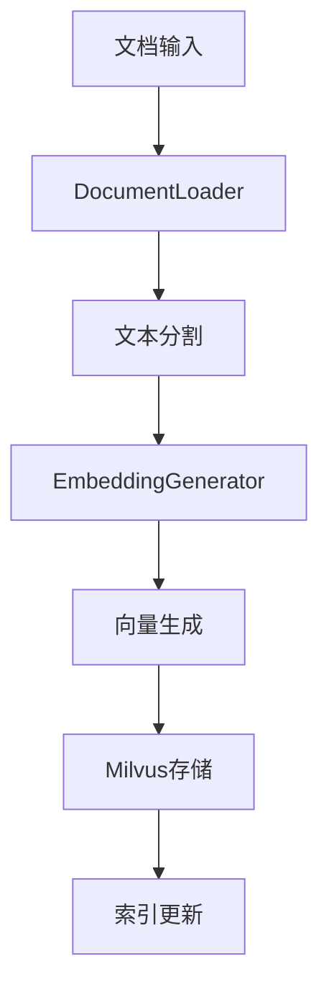
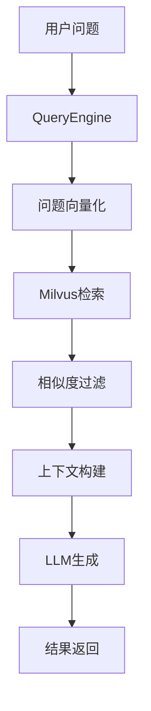

# RAG知识库系统架构设计

## 🏗️ 系统架构概览

RAG知识库系统采用分层架构设计，支持多Collection的企业级检索增强生成系统。

```
┌─────────────────────────────────────────────────────────────┐
│                    RAG System Layer                        │
│  ┌─────────────────┐  ┌─────────────────┐  ┌──────────────┐ │
│  │   RAGSystem     │  │ CollectionMgr   │  │ QueryEngine  │ │
│  └─────────────────┘  └─────────────────┘  └──────────────┘ │
└─────────────────────────────────────────────────────────────┘
┌─────────────────────────────────────────────────────────────┐
│                   Core Components Layer                    │
│  ┌─────────────────┐  ┌─────────────────┐  ┌──────────────┐ │
│  │ EmbeddingGen    │  │   LLMService    │  │ DocumentLoad │ │
│  └─────────────────┘  └─────────────────┘  └──────────────┘ │
└─────────────────────────────────────────────────────────────┘
┌─────────────────────────────────────────────────────────────┐
│                  Infrastructure Layer                      │
│  ┌─────────────────┐  ┌─────────────────┐  ┌──────────────┐ │
│  │ Milvus VectorDB │  │ Ollama Embed    │  │ DeepSeek LLM │ │
│  └─────────────────┘  └─────────────────┘  └──────────────┘ │
└─────────────────────────────────────────────────────────────┘
```

## 📦 核心组件详解

### 1. RAGSystem - 系统主入口

**职责**: 统一管理多个Collection，提供高级API接口

**核心功能**:
- Collection生命周期管理
- 多Collection查询协调
- 业务类型路由
- 系统资源管理

**关键方法**:
```python
class RAGSystem:
    async def initialize()                    # 系统初始化
    async def add_text(text, collection)      # 添加文本
    async def add_file(file_path, collection) # 添加文件
    async def query(question, collection)     # 单Collection查询
    async def query_multiple_collections()    # 多Collection查询
    async def query_business_type()           # 业务类型查询
```

### 2. QueryEngine - 查询引擎

**职责**: 处理单个Collection的检索和生成任务

**核心功能**:
- 向量检索
- 上下文构建
- LLM生成
- 结果封装

**查询流程**:
```
用户问题 → 向量化 → 相似度检索 → 上下文构建 → LLM生成 → 结果返回
```

### 3. CollectionManager - Collection管理器

**职责**: 管理Milvus中的向量Collection

**核心功能**:
- Collection创建/删除
- 索引管理
- 元数据管理
- 连接池管理

### 4. EmbeddingGenerator - 嵌入向量生成器

**职责**: 将文本转换为向量表示

**支持模型**:
- nomic-embed-text (默认)
- 其他Ollama支持的嵌入模型

**特性**:
- 批量处理
- 异步生成
- 缓存机制

### 5. LLMService - 大语言模型服务

**职责**: 基于上下文生成回答

**支持模型**:
- DeepSeek Chat (默认)
- 其他兼容OpenAI API的模型

**生成策略**:
- 通用RAG回答
- 业务专用回答
- 上下文感知生成

### 6. DocumentLoader - 文档加载器

**职责**: 处理各种格式的文档

**支持格式**:
- 文本文件 (.txt, .md)
- PDF文档
- Word文档
- 网页内容

**处理流程**:
```
文档 → 内容提取 → 文本分割 → 元数据提取 → 节点创建
```

## 🔄 数据流架构

### 文档添加流程



### 查询处理流程



## 🏢 多Collection架构

### Collection分类

1. **通用知识库** (general)
   - 用途: 通用问答
   - 特点: 广泛覆盖，通用性强

2. **测试用例知识库** (testcase)
   - 用途: 测试用例生成和优化
   - 特点: 专业性强，针对性优化

3. **UI测试知识库** (ui_testing)
   - 用途: UI自动化测试
   - 特点: 技术导向，实践性强

4. **AI对话知识库** (ai_chat)
   - 用途: 对话系统优化
   - 特点: 交互性强，上下文敏感

### Collection配置

```python
@dataclass
class CollectionConfig:
    name: str                    # Collection名称
    description: str             # 描述
    dimension: int = 768         # 向量维度
    business_type: str           # 业务类型
    top_k: int = 5              # 检索数量
    similarity_threshold: float  # 相似度阈值
    chunk_size: int             # 分块大小
    chunk_overlap: int          # 分块重叠
```

## 🔧 配置管理架构

### 配置层次

```
RAGConfig
├── MilvusConfig      # 向量数据库配置
├── OllamaConfig      # 嵌入模型配置
└── DeepSeekConfig    # 大语言模型配置
```

### 配置来源

1. **环境变量** - 生产环境配置
2. **配置文件** - 开发环境配置
3. **代码默认值** - 兜底配置

## 🚀 性能优化架构

### 异步处理

- 所有I/O操作异步化
- 并发处理多个请求
- 资源池管理

### 缓存策略

- 嵌入向量缓存
- 查询结果缓存
- 连接池复用

### 批处理优化

- 批量向量生成
- 批量数据库操作
- 批量索引更新

## 🛡️ 错误处理架构

### 异常层次

```
RAGError
├── CollectionError      # Collection相关错误
├── EmbeddingError      # 嵌入生成错误
├── QueryError          # 查询处理错误
└── ConfigError         # 配置错误
```

### 容错机制

- 自动重试
- 降级处理
- 错误恢复

## 📊 监控和日志架构

### 日志分级

- **DEBUG**: 详细调试信息
- **INFO**: 关键操作记录
- **WARNING**: 异常情况警告
- **ERROR**: 错误信息记录

### 性能监控

- 查询响应时间
- 向量生成耗时
- 数据库操作统计
- 系统资源使用

## 🔌 扩展性设计

### 插件化架构

- 自定义嵌入模型
- 自定义LLM服务
- 自定义文档加载器
- 自定义后处理器

### 水平扩展

- 多实例部署
- 负载均衡
- 分布式存储

## 🔒 安全架构

### 数据安全

- 敏感信息脱敏
- 访问权限控制
- 数据加密存储

### API安全

- 认证授权
- 请求限流
- 输入验证

## 📈 未来扩展方向

1. **多模态支持** - 图像、音频处理
2. **实时更新** - 增量索引更新
3. **联邦学习** - 分布式知识库
4. **智能路由** - 自动Collection选择
5. **知识图谱** - 结构化知识表示
