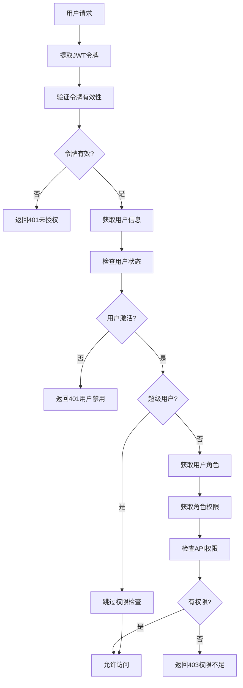

# 权限管理系统

## 📋 概述

本项目实现了企业级的基于角色的访问控制（RBAC）权限管理系统，提供了完整的用户认证、权限控制和API级别的安全保障。

## 🏗️ 系统架构

### 核心组件

```
权限管理系统
├── 认证模块 (Authentication)
│   ├── JWT令牌管理
│   ├── 密码安全哈希
│   └── 用户状态验证
├── 权限控制模块 (Authorization)
│   ├── 基于角色的权限检查
│   ├── API级别权限验证
│   └── 动态权限同步
├── 数据模型 (Data Models)
│   ├── 用户模型 (User)
│   ├── 角色模型 (Role)
│   ├── 部门模型 (Department)
│   └── API权限模型 (Api)
└── 管理服务 (Management Services)
    ├── 权限同步服务
    ├── 角色管理服务
    └── 用户管理服务
```

### 权限控制流程



## 🔧 核心功能

### 1. 三级权限控制

#### 仅认证 (`DependAuthOnly`)
- **用途**: 只验证用户身份，不检查具体权限
- **适用场景**: 用户个人信息、基础功能
- **使用方式**:
```python
@router.get("/profile", dependencies=[DependAuthOnly])
async def get_profile():
    pass
```

#### 权限检查 (`DependPermission`)
- **用途**: 验证用户是否有访问特定API的权限
- **适用场景**: 业务功能、数据操作
- **使用方式**:
```python
@router.get("/data", dependencies=[DependPermission])
async def get_data():
    pass
```

#### 管理员权限 (`DependAdmin`)
- **用途**: 验证用户是否为管理员
- **适用场景**: 系统管理、用户管理
- **使用方式**:
```python
@router.get("/admin", dependencies=[DependAdmin])
async def admin_function():
    pass
```

### 2. 自动权限同步

系统启动时自动执行以下操作：

1. **API发现**: 扫描FastAPI应用中的所有路由
2. **权限同步**: 将API信息同步到数据库
3. **增量更新**: 只更新变化的API信息
4. **默认权限**: 为管理员角色分配所有权限

```python
# 启动时自动同步
result = await permission_service.sync_apis_from_app(app)
# 输出: 新增 56 个，更新 0 个API权限
```

### 3. 密码安全

#### Argon2哈希算法
- **算法**: Argon2（业界最安全的密码哈希算法）
- **库**: `passlib[argon2]`
- **特性**: 抗彩虹表、抗暴力破解

```python
from passlib.context import CryptContext

pwd_context = CryptContext(schemes=["argon2"], deprecated="auto")

def get_password_hash(password: str) -> str:
    return pwd_context.hash(password)

def verify_password(plain_password: str, hashed_password: str) -> bool:
    return pwd_context.verify(plain_password, hashed_password)
```

### 4. JWT认证

#### 标准合规
- **标准**: JWT RFC 7519
- **算法**: HS256
- **字段**: `sub`（用户ID）、`username`、`exp`（过期时间）

```python
# JWT载荷示例
{
    "sub": "1",           # 用户ID（字符串格式）
    "username": "test",   # 用户名
    "user_id": 1,        # 用户ID（整数格式，兼容性）
    "exp": 1750642932    # 过期时间戳
}
```

## 📊 数据模型

### 用户模型 (User)
```python
class User(Model):
    id = fields.IntField(pk=True)
    username = fields.CharField(max_length=50, unique=True)
    email = fields.CharField(max_length=100, unique=True)
    password_hash = fields.CharField(max_length=255)
    is_active = fields.BooleanField(default=True)
    is_superuser = fields.BooleanField(default=False)

    # 关联关系
    dept = fields.ForeignKeyField("models.Department", null=True)
    roles = fields.ManyToManyField("models.Role")
```

### 角色模型 (Role)
```python
class Role(Model):
    id = fields.IntField(pk=True)
    name = fields.CharField(max_length=50, unique=True)
    description = fields.TextField(null=True)
    is_active = fields.BooleanField(default=True)

    # 关联关系
    apis = fields.ManyToManyField("models.Api")
```

### API权限模型 (Api)
```python
class Api(Model):
    id = fields.IntField(pk=True)
    path = fields.CharField(max_length=255)      # API路径
    method = fields.CharField(max_length=10)     # HTTP方法
    summary = fields.CharField(max_length=255)   # API摘要
    description = fields.TextField(null=True)    # API描述
    tags = fields.CharField(max_length=255)      # API标签
    is_active = fields.BooleanField(default=True)
```

## 🔍 使用指南

### 1. 在API路由中使用权限控制

```python
from backend.api_core.dependency import DependAuth, DependPermission, DependAdmin


# 仅需要认证
@router.get("/profile", dependencies=[DependAuthOnly])
async def get_user_profile(current_user: User = DependAuthOnly):
    return {"user": current_user.username}


# 需要API权限
@router.get("/data", dependencies=[DependPermission])
async def get_business_data():
    return {"data": "sensitive_data"}


# 需要管理员权限
@router.get("/admin/users", dependencies=[DependAdmin])
async def get_all_users(admin_user: User = DependAdmin):
    return await User.all()
```

### 2. 整个模块权限保护

```python
# 在路由注册时添加权限依赖
v1_router.include_router(
    system_router,
    prefix="/system",
    tags=["系统管理"],
    dependencies=[DependAdmin]  # 整个系统管理模块需要管理员权限
)
```

### 3. 手动权限同步

```python
# 手动触发API权限同步
@router.post("/apis/sync", dependencies=[DependAdmin])
async def sync_apis(request: Request):
    app = request.app
    result = await permission_service.sync_apis_from_app(app)
    return {"message": f"同步完成: 新增 {result['synced_count']} 个"}
```

## 🛡️ 安全特性

### 1. 密码安全
- ✅ Argon2哈希算法
- ✅ 盐值自动生成
- ✅ 抗彩虹表攻击
- ✅ 抗暴力破解

### 2. JWT安全
- ✅ 标准JWT格式
- ✅ 安全的密钥管理
- ✅ 令牌过期控制
- ✅ 字段类型验证

### 3. 权限控制
- ✅ 细粒度API权限
- ✅ 角色继承机制
- ✅ 动态权限验证
- ✅ 权限缓存优化

### 4. 审计日志
- ✅ 详细的认证日志
- ✅ 权限检查记录
- ✅ 操作轨迹追踪
- ✅ 安全事件告警

## 📈 性能优化

### 1. 权限缓存
- 用户权限信息缓存
- 角色权限映射缓存
- API权限列表缓存

### 2. 数据库优化
- 预加载关联数据
- 索引优化
- 查询优化

### 3. 内存管理
- 上下文变量管理
- 对象生命周期控制
- 内存泄漏防护

## 🔧 配置说明

### JWT配置
```yaml
# backend/conf/settings.yaml
SECRET_KEY: "your-secret-key-here"
ACCESS_TOKEN_EXPIRE_MINUTES: 30
ALGORITHM: "HS256"
```

### 权限配置
```yaml
# 权限管理配置
PERMISSION:
  AUTO_SYNC: true           # 启动时自动同步API
  CACHE_TTL: 3600          # 权限缓存时间（秒）
  LOG_LEVEL: "INFO"        # 权限日志级别
```

## 📋 API接口

### 认证接口
- `POST /api/v1/auth/login` - 用户登录
- `POST /api/v1/auth/logout` - 用户登出
- `POST /api/v1/auth/refresh` - 刷新令牌

### 系统管理接口
- `GET /api/v1/system/users` - 用户列表
- `GET /api/v1/system/roles` - 角色列表
- `GET /api/v1/system/apis` - API权限列表
- `POST /api/v1/system/apis/sync` - 同步API权限

### 权限管理接口
- `POST /api/v1/system/roles/{role_id}/permissions` - 分配角色权限
- `GET /api/v1/system/users/{user_id}/permissions` - 获取用户权限

## 🚀 快速开始

### 1. 启动系统
```bash
# 启动后端服务
python3 run.py

# 启动前端服务
cd frontend && npm run dev
```

### 2. 默认账户
- **用户名**: test
- **密码**: test
- **权限**: 超级管理员

### 3. 访问系统
- **前端**: http://localhost:3001
- **后端**: http://localhost:8000
- **API文档**: http://localhost:8000/docs

## 📚 相关文档

- [JWT认证详解](./JWT_AUTHENTICATION.md)
- [权限故障排查](../troubleshooting/PERMISSION_TROUBLESHOOTING.md)
- [数据库设计](../database/DATABASE_DESIGN.md)
- [API文档](../development/API_DOCUMENTATION.md)

---

## 📞 技术支持

如果在使用权限管理系统过程中遇到问题，请参考：
1. [故障排查文档](../troubleshooting/)
2. [开发指南](../development/)
3. [项目Issues](https://github.com/your-repo/issues)
